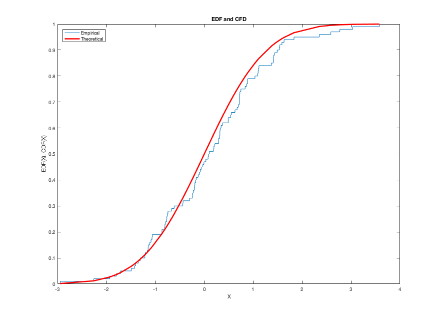

[](http://quantlet.de/index.php?p=info)

## [](http://quantlet.de/) **MSEGCthmnorm** [](http://quantlet.de/d3/ia)

```yaml

Name of QuantLet : MSEGCthmnorm

Published in : 'Modern Mathematical Statistics: Exercise and Solution'

Description : 'Draws n observations from standard normal distribution and plots its empirical
distribution function (edf) vs. the normal cumulative distribution function (cdf). Number of draws
can be entered interactively. The point where the edf and cdf differs most is also reported.'

Keywords : 'plot, cdf, edf, empirical, distribution, distance, normal, normal-distribution, random,
gaussian '

Author : Wolfgang Härdle, Shih-Kang Chao

Submitted : Mon, November 05 2012 by Dedy Dwi Prastyo

Example : '1. Draws n=100 observations from standard normal distribution and plots its empirical
distribution function (edf) vs. the normal cumulative distribution function (cdf). 2.  The point
where the edf and cdf differs most is also reported.'

Inputs : n - number of observations

```




### MATLAB Code:
```matlab
close all
clear all
clc

disp('Please input number of draws n as') ;
disp(' ') ;
n  = input('[n]=');
y  = normrnd(0,1,n,1);      % Generate standard normal random numbers
y  = sort(y);
cdfplot(y)                  % Plot the empirical distribution function
hold on
f  = cdf('Normal',y,0,1);   % Generate normal cumulative distribution function

plot(y,f,'r','LineWidth',2.5)
legend('Empirical','Theoretical','Location','NW')
title('EDF and CFD')
xlabel('X')
ylabel('EDF(X), CDF(X)')
grid off

[g,y] = ecdf(y);
g     = g(2:(n+1));
[C,I] = max(abs(f-g))
hold off
```
