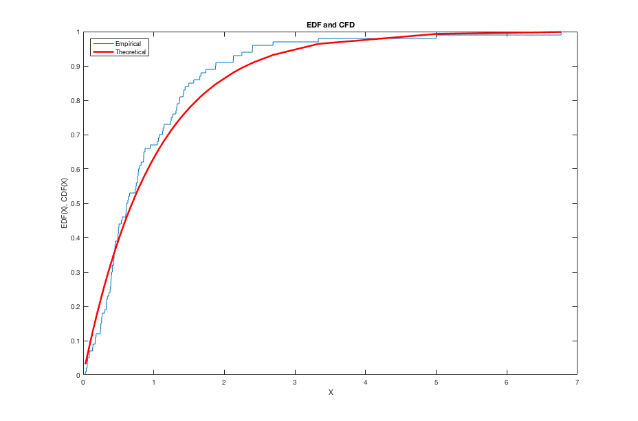

[](http://quantlet.de/index.php?p=info)

## [](http://quantlet.de/) **MSEGCthmexp** [](http://quantlet.de/d3/ia)

```yaml

Name of QuantLet : MSEGCthmexp

Published in : 'Modern Mathematical Statistics: Exercise and Solution'

Description : 'Draws n observations from exponential(1) distribution and plots its empirical
distribution function (edf) vs. the exponential cumulative distribution function (cdf). Number of
draws can be entered interactively. The point where the edf and cdf differs most is also reported.'

Keywords : plot, cdf, edf, empirical, distribution, distance, exponential

Author : Wolfgang Karl Haerdle, Vladimir Panov, Vladimir Spokoiny, Weining Wang

Submitted : Mon, November 05 2012 by Dedy Dwi Prastyo

Example : '1. Draws n=100 observations from exponential distribution and plots its empirical
distribution function (edf) vs. the theoretical exponential cumulative distribution function (cdf).
2.  The point where the edf and cdf differs most is also reported.'

Inputs : n - number of observations

```




### MATLAB Code:
```matlab
close all
clear
clc

disp('Please input number of draws n as') ;
disp(' ') ;
n  = input('[n]=');
y  = exprnd(1,n,1);            % Generate standard normal random numbers
y  = sort(y);
cdfplot(y)                     % Plot the empirical distribution function
hold on
f  = cdf('Exponential',y,1);   % Generate exponential cumulative distribution function

plot(y,f,'r','LineWidth',2.5)
legend('Empirical','Theoretical','Location','NW')
title('EDF and CFD')
xlabel('X')
ylabel('EDF(X), CDF(X)')
grid off

[g,y] = ecdf(y);
g     = g(2:(n+1));
[C,I] = max(abs(f-g))
hold off
```
