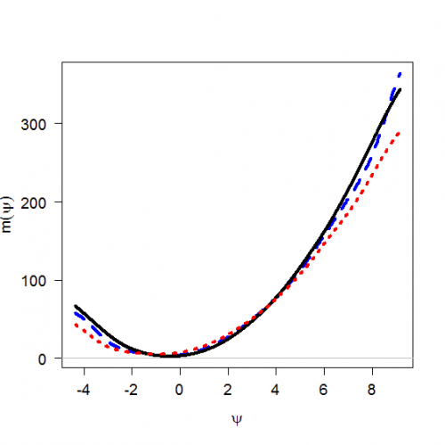

[](http://quantlet.de/index.php?p=info)

## [](http://quantlet.de/) **MSEdecon** [](http://quantlet.de/d3/ia)

```yaml

Name of QuantLet : MSEdecon

Published in : 'Modern Mathematical Statistics : Exercises and Solutions'

Description : 'Plots the deconvoluted kernel regression curve, the kernel regression curve from the
sample without measurement errors (i.e. kernel regression based on x) and the kernel regression
curve from the sample with measurement errors (i.e. kernel regression based on z).'

Keywords : plot, kernel, regression, curve, error

Author : Wolfgang Karl Haerdle, Vladimir Panov, Vladimir Spokoiny, Weining Wang

Submitted : Fri, November 09 2012 by Dedy Dwi Prastyo

Example : 'The kernel regression curve from the sample without measurement errors (solid line), the
deconvoluted kernel regression curve (dashed line), and the regression curve from the sample with
measurement errors (dotted line), for n=300.'

```




### R Code:
```r
# install.packages('decon')
library(decon)

n = 3000
x = rnorm(n, 3, 2)

sig = 0.9
u = sig * rnorm(n)
w = x + u
e = rnorm(n, 0, 0.1)
y = 5 * x^2 + e

bw1 <- bw.dboot1(w, sig)
m = DeconNpr(w, sig, y, error = "normal", from = min(x), to = max(x))

plot(m, col = "blue", cex.axis = 1.2, font.axis = 1, cex.lab = 1.2, las = 1, lwd = 4, lty = 2, xlab = expression(paste(psi)), 
    ylab = expression(paste(m(psi))), main = "")
ks_uncon = ksmooth(x, y, kernel = "normal", 2, range.x = c(min(x), max(x)))
lines(ks_uncon, col = "black", lwd = 4, lty = 1)
ks_con = ksmooth(w, y, kernel = "normal", 2, range.x = c(min(x), max(x)))
lines(ks_con, col = "red", lwd = 4, lty = 3) 

```
