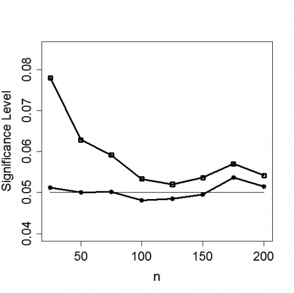

[](http://quantlet.de/index.php?p=info)

## [](http://quantlet.de/) **MSEex0913** [](http://quantlet.de/d3/ia)

```yaml

Name of QuantLet : MSEex0913

Published in : 'Modern Mathematical Statistics: Exercises and Solutions'

Description : Plots the significance levels in context with n from n=1 to n=200.

Keywords : asymptotic chisquare test, f-test, plot, visualization, estimation

Author : Wolfgang K. Haerdle, Weining Wang, Shih Kang Chao

Submitted : Wed, August 03 2011 by Dedy Dwi Prastyo

Example : Significance levels for different n in order to illustrate the exercise.

```




### R Code:
```r
rm(list = ls(all = TRUE))  # Close windows and clear variables
alpha = 0.05  # Significance Level
n = c(25, 50, 75, 100, 125, 150, 175, 200)  # Sample sizes
p = 3  # Number of Parameters to be estimated
I = 10000  # Iteration times
sig_level = matrix(0, 2, length(n))
for (j in 1:length(n)) {
    chi = qchisq(alpha, p, ncp = 0, lower.tail = FALSE, log.p = FALSE)
    F = p * qf(alpha, p, n[j] - p, ncp = 0, lower.tail = FALSE, log.p = FALSE)
    temp1 = 0
    temp2 = 0
    for (i in 1:I) {
        x1 = rnorm(n[j], mean = 0, sd = 1)
        x2 = rnorm(n[j], mean = 0, sd = 1)
        y = rnorm(n[j], mean = 0, sd = 1)
        x = cbind(x1, x2)
        ols = lm(y ~ x)
        T = ((n[j] - p) * sum(ols$fitted.values^2))/(sum(ols$residual^2))
        if (T > chi) {
            temp1 = temp1 + 1
        }
        if (T > F) {
            temp2 = temp2 + 1
        }
    }
    sig_level[1, j] = temp1/I
    sig_level[2, j] = temp2/I
}
plot(n, sig_level[1, ], pch = 0, lwd = 3, ylim = c(0.04, 0.085), xlab = "n", ylab = "Significance Level", cex.axis = 1.5, cex.lab = 1.5)
lines(n, sig_level[1, ], lwd = 3)
lines(n, sig_level[2, ], lwd = 3)
lines(n, c(0.05, 0.05, 0.05, 0.05, 0.05, 0.05, 0.05, 0.05), lwd = 1)
points(n, sig_level[2, ], pch = 1, lwd = 3) 

```
