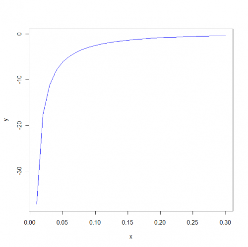

[](http://quantlet.de/)

## [](http://quantlet.de/) **MSEklnatparam** [](http://quantlet.de/)

```yaml

Name of QuantLet : MSEklnatparam

Published in : 'Modern Mathematical Statistics: Exercises and Solutions'

Description : Draws a plot of the Kullback-Leibler function for a natural parameter.

Keywords : plot, visualization, Kullback-Leibler, function, parameter

Author : Wolfgang Karl Haerdle, Vladimir Panov, Vladimir Spokoiny, Weining Wang

Submitted : Mon, September 27 2010 by Maria Osipenko

Example : Plot of the Kullback-Leibler function f(theta) for a natural parameter.

```




### R Code:
```r
x = seq(0.01, 0.3, 0.01)
y = -0.4/x - 0.5 * log(x) + 0.4
plot(x, y, "l", col = "blue") 

```
