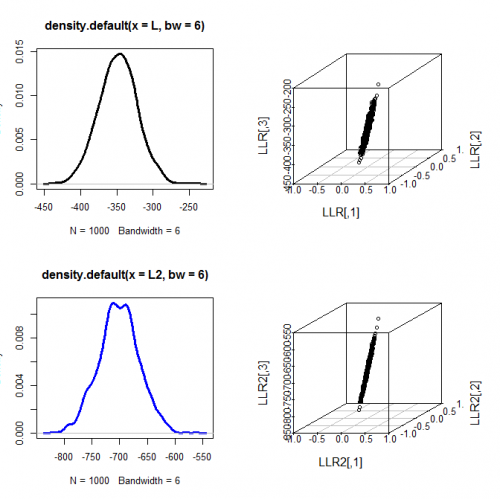

[](http://quantlet.de/index.php?p=info)

## [](http://quantlet.de/) **MSEloglikelihood** [](http://quantlet.de/d3/ia)

```yaml

Name of QuantLet : MSEloglikelihood

Published in : 'Modern Mathematical Statistics : Exercises and Solutions'

Description : 'Creates plots and scatterplots of densities and LLR for two different parameters
theta.'

Keywords : 'density, eigenvalue-decomposition, graphical representation, kernel, log-likelihood,
scatterplot, visualization'

Author : Maria Osipenko, Lukas Borke

Submitted : Thu, March 05 2015 by Lukas Borke

Example : Plots and scatterplots for two different parameters theta.

```




### R Code:
```r
rm(list = ls(all = TRUE))

install.packages("scatterplot3d")
library(scatterplot3d)

n			= 100
m			= 1000
theta		= c(1, 1)
theta2		= c(1.7, 1)
theta_star	= c(0, 0)
D2			= matrix(c(3, 1, 1, 2), nrow = 2)
D			= eigen(D2)$vectors %*% diag(sqrt(eigen(D2)$values)) %*% t(eigen(D2)$vectors)
z			= (1/sqrt(n)) * solve(D) %*% matrix(rnorm(2 * m), nrow = 2)
aa			= n * t(D %*% (theta - theta_star)) %*% (D %*% (theta - theta_star))
aa2			= n * t(D %*% (theta2 - theta_star)) %*% (D %*% (theta2 - theta_star))
aa			= as.numeric(aa)
aa2			= as.numeric(aa2)
L			= n * t(theta - theta_star) %*% D2 %*% z - aa * matrix(1, 1, m)/2
L2			= n * t(theta2 - theta_star) %*% D2 %*% z - aa2 * matrix(1, 1, m)/2

LLR			= t(rbind(z[1, ], z[2, ], L))
LLR2		= t(rbind(z[1, ], z[2, ], L2))

layout(matrix(1:4, 2, 2))
plot(density(L, bw = 6), lwd = 3)
plot(density(L2, bw = 6), lwd = 3, col = "blue")
axlim = c(-1, 1)

scatterplot3d(LLR, xlim = axlim, ylim = axlim)
scatterplot3d(LLR2, xlim = axlim, ylim = axlim) 

```
