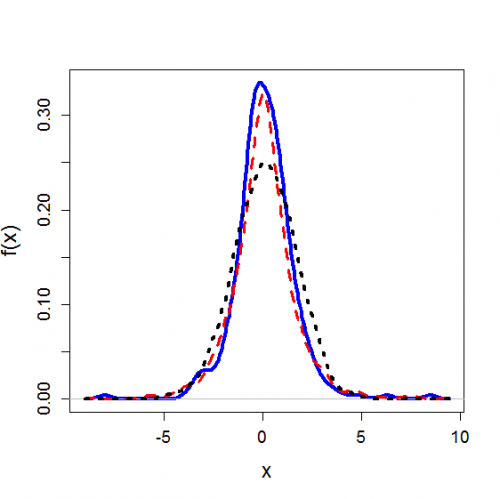

[](http://quantlet.de/)

## [](http://quantlet.de/) **MSEnonpara1** [](http://quantlet.de/)

```yaml

Name of QuantLet : MSEnonpara1

Published in : 'Modern Mathematical Statistics: Exercises and Solutions'

Description : 'Generates an n=300 t(3) distributed random sample, and draws the kernel density
curve of the estimated kernel density function using a Gaussian kernel, since the kernel density
function is biased.'

Keywords : plot, kernel, density, nonparametric, nonparametric estimation

Author : Wolfgang Karl Haerdle, Vladimir Panov, Vladimir Spokoiny, Weining Wang

Submitted : Fri, November 09 2012 by Dedy Dwi Prastyo

Output : '1. Draws n_1 observations from t(3) distribution and plots the kernel density curve of
the estimated kernel density function using a Gaussian kernel. 2. generates n observations from
t(3) distribution and plots the expectation of the kernel density function under the true density
which is t(3) distribution. 3. generates n observations from normal distribution with mean and
standard deviation from the generated sample, plots the expectation of the kernel density function
under the true density which is normal distribution with mean and standard deviation from the
generated sample.'

Example : 'The kernel density estimator ^fh(x) (solid line), ^g(x) with f0=t(3) (dashed line), and
^g(x) with f0=N(^mu, ^sigma^2), for n=300.'

```




### R Code:
```r
# % ------------------------------------------------------------------------- % Book: MSE %
# ------------------------------------------------------------------------- % Quantlet: MSEnonpara1 %
# ------------------------------------------------------------------------- % Description: MSEnonpara1 generate n=300 t(3)
# distributed random sample, and draws the kernel density curve of the estimated kernel density function using a % Gaussian
# kernel. Since the kernel density function is biased in a finite sample, one can not compare it with the true density
# directly. One rather compare it with the expectation of the kernel density function under the true density. Then it draws
# the expectation of the kernel density function under the true density. %
# ------------------------------------------------------------------------- % Usage: - %
# ------------------------------------------------------------------------- % Inputs: n_1 - number of observations %
# ------------------------------------------------------------------------- % Output: 1. Draws n_1 observations from t(3)
# distribution % and plots the kernel density curve of the estimated kernel density function using a % Gaussian kernel. % %
# 2. generate n observations from t(3) distribution and plots the expectation of the kernel density function under the true
# density which is t(3) distribution. % 3. generate n observations from normal distribution with mean and standard deviation
# from the generated sample, plots the expectation of the kernel density function under the true density which is normal
# distribution with mean and standard deviation from the generated sample. %
# ------------------------------------------------------------------------- % Example: n_1 = 300 % n_1 = 3000 %
# ------------------------------------------------------------------------- % Author: Weining Wang, Lining Yu %
# -------------------------------------------------------------------------

n_1 = 300
obs = rt(n_1, 3)
den_x = density(obs, kernel = "gaussian", bw = "nrd0")
plot(den_x, lwd = 4, lty = 1, col = "blue", cex.axis = 1.2, font.axis = 1, cex.lab = 1.5, las = 0, xlab = "x", ylab = "f(x)", 
    main = "")

n = 1e+06
z = rt(n, 3)
h = den_x$bw
g = 1:512

for (j in 1:length(den_x$x)) {
    sum_k = 0
    for (i in 1:length(z)) {
        u = (den_x$x[j] - z[i])/h
        k = exp(-u^2/2)/sqrt(2 * pi)
        sum_k = sum_k + k
    }
    g[j] = 1/(h * length(z)) * sum_k
}

lines(den_x$x, g, lwd = 3, lty = 2, col = "red")
mu = mean(obs)
sd = sd(obs)
q = rnorm(n, mu, sd)
f = 1:512

for (j in 1:length(den_x$x)) {
    sum_k = 0
    for (i in 1:length(q)) {
        u = (den_x$x[j] - q[i])/h
        k = exp(-u^2/2)/sqrt(2 * pi)
        sum_k = sum_k + k
    }
    f[j] = 1/(h * length(z)) * sum_k
}

lines(den_x$x, f, lwd = 4, lty = 3, col = "black") 

```
