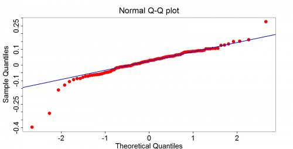

[](http://quantlet.de/index.php?p=info)

## [](http://quantlet.de/) **MSEqlretqqplot** [](http://quantlet.de/d3/ia)

```yaml

Name of QuantLet : MSEqlretqqplot

Published in : 'Modern Mathematical Statistics: Exercises and Solutions'

Description : 'Plots quarterly S&P log-returns for data from Q2 1980 to Q2 2012 to check the
normality assumption for log-returns.'

Keywords : qq-plot, plot, visualization, financial, distribution, normal

Author : Wolfgang K. Haerdle, Weining Wang, Shih Kang Chao

Submitted : Thu, November 15 2012 by Dedy Dwi Prastyo

Datafile : spq.txt

Example : QQ-plot for S&P index quarterly log-returns during the period Q2 1980 - Q2 2012.

```




### R Code:
```r
# install.packages('boot') install.packages('pastecs') install.packages('graphics')

library(boot)
library(pastecs)
library(graphics)

file = "spq"

datafile = paste(file, "txt", sep = ".")

quarterly = read.table(datafile, sep = "", dec = ",")
colnms = c("date", "year", "price")

colnames(quarterly) = colnms
attach(quarterly)

return = diff(log(price))
n = length(diff(log(price)))

par(mai = c(1, 1.3, 1, 1))
qqnorm(return, cex.axis = 2.2, cex.main = 2.8, cex = 2.5, col = "red", bg = "red", cex.lab = 2.8, pch = 21, ann = FALSE, axes = FALSE, 
    frame = TRUE)
qqline(return, col = 4, lwd = 3)

mtext(side = 3, text = "Normal Q-Q plot", line = 1, cex = 2.8)
mtext(side = 1, text = "Theoretical Quantiles", line = 4, cex = 2.5)
mtext(side = 2, text = "Sample Quantiles", line = 4, cex = 2.5)
axis(side = 2, at = seq(-0.4, 0.3, by = 0.05), label = seq(-0.4, 0.3, by = 0.05), lwd = 1.2, cex.axis = 2.5, lwd.ticks = 2.5)
axis(side = 1, at = seq(-3, 3, by = 1), label = seq(-3, 3, by = 1), lwd = 1, cex.axis = 2.5, padj = 0.5, lwd.ticks = 2.5) 

```
